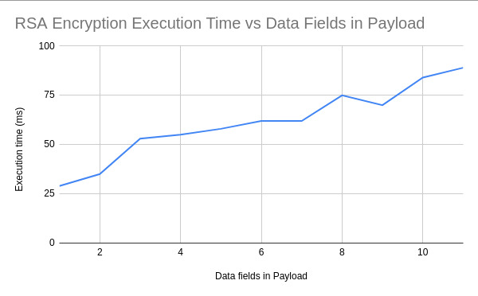
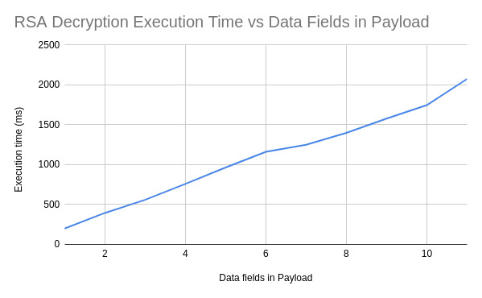

# DID FRAMEWORK FOR AADHAR

The project is part of research project titled "Blockchain-Enabled Aadhar 2.0" co-authored by <a href="https://iitjammu.ac.in/computer_science_engineering/faculty-list/~harkeeratkaur">Dr.Harkeerat Kaur</a>, <a href="https://github.com/aryannewyork">Aryan Shukla</a>, <a href="https://github.com/Touseef-md">Mohammad Touseef</a> and <a href="https://github.com/Sigma2345/" >Mudit Jain</a>. The project is a proof of concept of the designed framework. The repository involves smart contracts deployed locally on hardhat test node.

The Decentralized Identity Information involves the following component encrypted using the user's public key. The status field indicates if the current identity is still valid or revoked. The face and fingeprint are first encrypted using pseudo biometric encryption as explained 
<a href="https://scholar.google.co.in/citations?view_op=view_citation&hl=en&user=Mt1kwb0AAAAJ&citation_for_view=Mt1kwb0AAAAJ:IjCSPb-OGe4C" >here</a> 

```json
{
    "NAME":"Encrypted(Name, Pa)",
    "DOB":"Encrypted(DDMMYYYY, Pa)",
    "FATHER NAME":"Encrypted(Father's Name, Pa)",
    "MOTHER NAME":"Encrypted(Mother's Name, Pa)",
    "ADDRESS":
            {
            "LINE1":"Encrypted(Line1, Pa)",
                "PINCODE":"Encrypted(Pincode, Pa)"
            },
    "PBIV":
            {
                "FACE":"Encrypted(RDM(Face Vector, SEED), Pa))",
                "FINGERPRINT":"Encrypted(RDM(Fingerprint Vector,SEED),Pa)"
            },
    "PHONENUMBER":"Encrypted(+91XXXXXXXXXX, Pa)",
    "STATUS":"Active/Revoked" , 
    "APPROVALS": "(FIELD, NEWVAL)"   
}
```
<ul>
    <li>
        The deploy folder involves scripts to deploy the scripts on local hardhat node  
    </li>
    <li>
        The scripts folder contains scripts to upload information, get and edit information using the local hardhat node 
    </li>
    <li>
        The testing folder contains the testing scripts used for testing the time taken for encryption and decryption of the information uploaded on chain. 
    </li>
</ul>


## GETTING STARTED
<ol>
    <li>
        Clone the repo using <b>git clone https://github.com/Sigma2345/DIDResearch.git</b>
    </li>
    <li>
        Add all the required dependencies using comamnd <b>yarn</b> 
    </li>
    <li>
        Spin up the local hardhat node usign <b>yarn hardhat node</b>
    </li>
    <li>
        Open Another terminal window
    </li>
    <li>
        deploy the contract using <b>yarn hardhat deploy --network localhost</b>
    </li>
    <li>
        To enter Information , use <b>yarn hardhat run scripts/enterInfo.js --network localhost</b>
    </li>
    <li>
        To get Information , use <b>yarn hardhat run scripts/getInfo.js --network localhost</b>
    </li>
    <li>
        To update Information , use <b>yarn hardhat run scripts/updateInfo.js --network localhost</b>
    </li>
</ol>

## Observations 

The scripts for encryption and decryption of payload resulted in the following observations. The payload is arranged in order of increasing payload size.
<br></br>
<div align="center">

<b>Encryption time taken vs payload (increasing payload size)</b>
</img>
<br></br>

<b>Decryption time taken vs payload (increasing payload size)</b>
</img>
</div>

